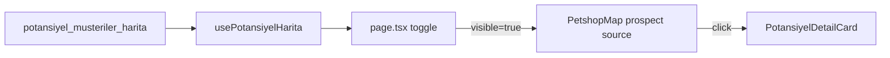

# Potansiyel Müşteri Harita Katmanı

Brief: [`cursor-brief-potansiyel-harita-katmani.md`](c:/Users/ıntel%20pc/Downloads/cursor-brief-potansiyel-harita-katmani.md). Kaynak zaten production’da: view `potansiyel_musteriler_harita` (yalnız `eslesme_durumu = 'yeni'`). Frontend henüz bağlı değil.

## Kararlar (kilitli)

- Toggle **varsayılan kapalı** (kalabalık önleme).
- Mevcut `musteriler` risk katmanına dokunma; prospect ayrı source/layer.
- Detay: hafif kart (`isim`, `adres`, `il`/`ilce`, `primary_type`, `tarandigi_tarih`) — `CustomerDetailPanel` kullanılmaz.
- `suspicious_name` → düşük opacity; risk renkleri kullanılmaz (nötr teal/slate).
- Sayfalama zorunlu (~3k+ satır; PostgREST 1000 limiti).

## 1) Tip + sabitler

- [`frontend/lib/supabase.ts`](frontend/lib/supabase.ts): `POTANSIYEL_MUSTERILER_HARITA_VIEW = "potansiyel_musteriler_harita"`
- [`frontend/lib/types.ts`](frontend/lib/types.ts): `PotansiyelHarita` (`id`, `isim`, `adres`, `ilce`, `il`, `lat`, `lon`, `primary_type`, `kalite_bayragi`, `tarandigi_tarih`)

## 2) Veri hook

Yeni [`frontend/hooks/usePotansiyelHarita.ts`](frontend/hooks/usePotansiyelHarita.ts) — `useMusteriHarita` deseni:

- Sayfalı `.select(...).not('lat','is',null).not('lon','is',null).range(from, to)` (PAGE=1000)
- `loading` / `error` / `refresh`
- Toggle kapalıyken bile prefetch edilebilir veya ilk açılışta lazy fetch (lazy tercih: toggle ilk açılınca bir kez yükle, cache’te tut)

## 3) GeoJSON + Mapbox katmanı

- [`frontend/lib/geojson.ts`](frontend/lib/geojson.ts) yanına veya yeni `potansiyel-geojson.ts`: FeatureCollection (`id` property)
- Yeni [`frontend/lib/map-potansiyel-layers.ts`](frontend/lib/map-potansiyel-layers.ts):
  - Source: `potansiyeller` (cluster **kapalı** veya düşük — öneri: cluster yok, ~3k circle OK)
  - Layer: `potansiyel-point` — küçük circle, renk `#5eead4` (teal), stroke slate; `kalite_bayragi == suspicious_name` → opacity ~0.35
- [`PetshopMap.tsx`](frontend/components/map/PetshopMap.tsx):
  - Props: `potansiyelData`, `potansiyelVisible`, `selectedPotansiyelId`, `onSelectPotansiyel`
  - Mount: müşteri katmanlarından sonra, route casing’den önce
  - `setLayoutProperty(..., 'visibility')` ile toggle
  - Click handler + boş harita tıklanınca prospect seçimini de temizle
  - Müşteri `recreateCustomerSource` prospect source’u silmesin

## 4) Toggle UI

Yeni `PotansiyelLayerToggle` (RiskModeToggle stili):

- Masaüstü: `.risk-mode-toggle-anchor` yanında veya altında
- Mobil: üst overlay stack’te RiskModeToggle ile birlikte
- Label: **Potansiyel**; aktifken sayaç `X` (opsiyonel küçük badge)
- State: `page.tsx` `showPotansiyel` (localStorage key `locus:show-potansiyel` isteğe bağlı — ekle)

## 5) Hafif detay kartı

Yeni `PotansiyelDetailCard` — map overlay absolute, müşteri panelinden bağımsız:

- Alanlar: isim, adres, ilçe/il, primary_type (okunur etiket: pet_store → Petshop, veterinary_care → Veteriner), tarandigi_tarih
- Kapat: X veya boş harita tıklama
- Müşteri kartı açıksa prospect seçilince müşteri kartını kapat (tersi de)

## 6) Kabul

- Yalnız view satırları; `mevcut_musteri` / `manuel_kontrol` yok
- Toggle aç/kapa; müşteri risk renkleri bozulmaz
- ≥1000 satır tam yüklenir
- Click → hafif kart; risk paneli açılmaz
- Mobile toggle erişilebilir

## Bilinçli dışarıda

İZTO, RLS, n8n, risk mantığının prospect’e kopyası, `musteriler_harita` değişikliği.
