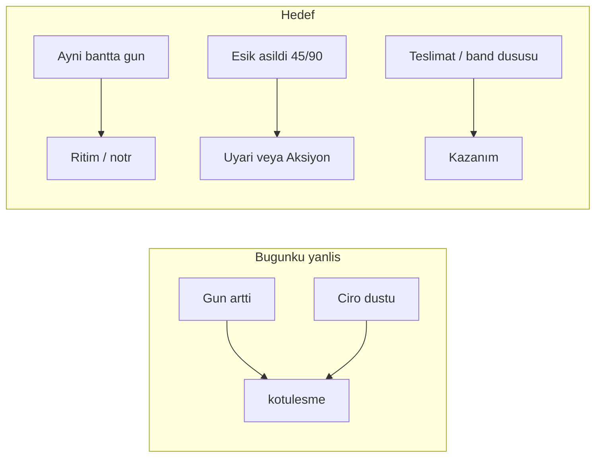

# Ritim Formu: eşik-öncesi yanlış indikasyonu kesen oyun sistemi

## Problem

Bugünkü mantık ([`frontend/lib/snapshot-compare.ts`](frontend/lib/snapshot-compare.ts)) her gün artışını ve %5 ciro düşüşünü **kötüleşme** sayıyor. İki sevkiyat yüklemesi arasında doğal yaşlanma (ör. 12→27 gün, hâlâ &lt;45) “kötüleşti” üretir — bu operasyonel karar için **yanlış sinyal**.



## Tasarım ilkeleri

1. **Zaman cezası yok, eşik sinyali var** — Gün sayacı artmak skor düşürmez; yalnızca 45 / 90 band geçişleri karar üretir.
2. **Asimetrik puan** — Puan (XP) yalnızca kazanımlara: yeni teslimat, risk↓, eşik altında kalma streak. “Kötüleşme puanı” yok.
3. **Baskı ≠ ceza** — `baski = gun / 90` (0–1) yaklaşma göstergesi; kırmızı “kötü” değil, “eşiğe kalan mesafe”.
4. **Yükleme aralığı gürültüsü** — Aynı risk bandında gün/ciro delta’sı nötr (`ritim`). Ciro tek başına yön çevirmez.
5. **Dil aksiyon odaklı** — `iyilesme/kotulesme` → `kazanim | ritim | uyari | aksiyon | sessiz`.

## Durum makinesi (müşteri formu)

| Durum | Koşul | Anlam | Kart rengi |
|-------|--------|--------|------------|
| `ritimde` | teslimat var, gun ≤ 45 | Karar gerekmez | yeşil |
| `yaklasiyor` | 45 &lt; gun ≤ 90 | İzle / ziyaret planla | sarı |
| `esik_asildi` | gun &gt; 90 | Aksiyon | kırmızı |
| `sessiz` | teslimat 0 | İlk temas | gri |

**Olaylar** (önceki snapshot ↔ yeni, yalnızca anlamlı geçişler):

- `kazanim` — band iyileşti veya aynı bandda gün belirgin düştü (yeni teslimat)
- `uyari` — `ritimde` → `yaklasiyor` (45 aşıldı)
- `aksiyon` — herhangi → `esik_asildi` veya `sessiz` kaldı / girdi
- `ritim` — aynı band, eşik geçilmedi (gün artışı dahil)
- `sessiz` — önceki yok / ilk kayıt

Yükleme günü ile gecikme eşiği **geçilmedikçe** olay asla `kotulesme` üretmez; en fazla `ritim` veya baskı metresi dolar.

## Oyun metrikleri

Tek müşteri:

- **Form durumu** — yukarıdaki 4 durum
- **Baskı metresi** — `clamp(gun/90, 0, 1)` — RiskDağılım tarzı segment bar (mevcut UI dili)
- **Streak** — ardışık sevkiyat yüklemelerinde `ritimde` kalan yükleme sayısı (snapshot’tan türetilir; yoksa 0/1)
- **XP bu yükleme** — yalnızca `kazanim` için sabit paket (ör. band↓ +30, yeni teslimat +20); uyarı/aksiyon XP vermez, rozet/etiket verir
- **Son olay** — `kazanim|uyari|aksiyon|ritim|sessiz`

Portföy (yükleme özeti):

```ts
{
  kazanim: number;
  uyari: number;      // 45 geçişi
  aksiyon: number;    // 90 / sessiz kritik
  ritim: number;      // nötr — yanlış alarm değil
  form_dagilim: Record<FormDurumu, number>;
}
```

`iyilesme_orani` / `kotulesen` kaldırılır veya AI’da kullanılmaz. Özet cümle: *“X kazanım, Y uyarı, Z aksiyon; N müşteri ritimde.”*

## Uygulama adımları

### 1. Çekirdek motor

Yeni veya yeniden yazılmış modül: [`frontend/lib/snapshot-compare.ts`](frontend/lib/snapshot-compare.ts) (veya `frontend/lib/ritim-form.ts` + re-export).

- `formDurumu(metrics)` — 45/90 eşikleri (view ile aynı: [`sema.sql`](sema.sql) case)
- `classifyOlay(onceki, yeni)` — yukarıdaki olay kuralları; **aynı bandda gün↑ → ritim**
- `baskiOrani(gun)` — cezasız yaklaşma
- `buildPortfolioForm(...)` — `YuklemeKarsilastirma` yerine form özeti
- Eski `classifyDegisim` / `iyilesmeSkoru` / `kotulesen` API’si kaldırılır veya ince wrapper ile deprecate

Eşikler tek sabitte toplanır (`IZLE_GUN = 45`, `AKSIYON_GUN = 90`) — paneldeki `GECIKME_ESIK_GUN` ile paylaşılır.

### 2. Upload pipeline

[`frontend/app/api/upload/route.ts`](frontend/app/api/upload/route.ts) — Sevkiyat sonrası `buildPortfolioKarsilastirma` → `buildPortfolioForm`; `yukleme_loglari.karsilastirma` jsonb şeması yeni alanlara döner.

Snapshot şeması değişmez (`onceki_*` yeterli); streak için panel son N snapshot’ı isteğe bağlı çekebilir (ilk sürümde streak = son olay `ritimde` ise 1, değilse 0 — basit).

### 3. Müşteri kartı Değişim sayfası

[`frontend/components/map/CustomerDetailPanel.tsx`](frontend/components/map/CustomerDetailPanel.tsx):

- “İyileşme / Kötüleşme / %skor” → **Form + Baskı barı + Son olay rozeti**
- Liste: Risk geçişi (yalnızca band değiştiyse vurgulu), gün (mesafe: “eşiğe X gün”), ciro/teslimat bilgisel (yön etiketi yok)
- Metin: *“Ritimde — karar gerekmez”* / *“Uyarı — 45 gün aşıldı”* / *“Aksiyon — 90 gün aşıldı”* / *“Kazanım — teslimat yenilendi”*

### 4. AI metni

[`frontend/lib/agent-states.ts`](frontend/lib/agent-states.ts) `buildUploadAnalysis` — “iyileşti/kötüleşti” yerine kazanım / uyarı / aksiyon / ritim sayıları.

### 5. Tipler

[`frontend/lib/import/types.ts`](frontend/lib/import/types.ts) — `karsilastirma` tipi yeni form özetine bağlanır.

## Kapsam (varsayılan)

**Kart Değişim sayfası + Sevkiyat yükleme AI / log özeti.** Sidebar’a ayrı “form paneli” bu turda yok; aynı motor sonra oraya bağlanabilir.

## Bilinçli olarak yapmayacaklarımız

- Gün artışı için negatif XP / kırmızı “kötüleşme” barı
- Ciro gürültüsünden otomatik negatif olay
- Eşik altındayken band “düşüşü” uydurma

## Doğrulama senaryoları

| Senaryo | Beklenen olay |
|---------|----------------|
| 10→30 gün, hâlâ ≤45 | `ritim`, baskı artar |
| 40→50 gün | `uyari` (45 geçişi) |
| 80→95 gün | `aksiyon` |
| 100→20 gün (teslimat) | `kazanim` |
| Aynı dosya iki kez, metrik aynı | `ritim` |
| Ciro −8%, gün/band aynı | `ritim` (ciro satırı bilgisel) |
